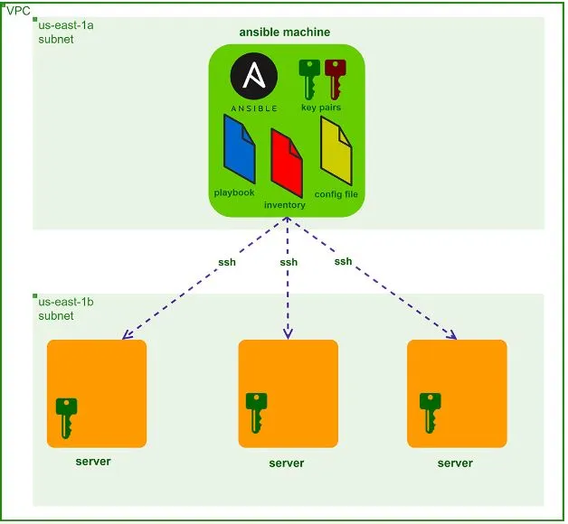
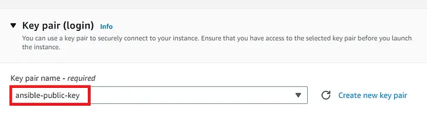
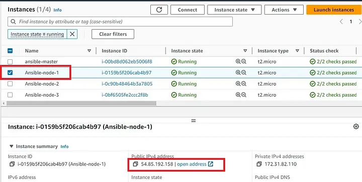

# Deploy a website on an Apache Web Server on Multiple EC2 Instances using Ansible Playbook


## Ansible

Ansible delivers simple IT automation that ends repetitive tasks for more strategic work.

Goal is deploy a website on multiple ec2 instances using Ansible Playbooks without need the install the service on each server separately using the power of Automation. 

Architecture of project:



Create security group for ansible-master node with allowing inbound rules to port 22, outbound rules - All traffic:


Now let’s create another security group that would be common for all three Ansible nodes on which we would deploy the web server.
Under Inbound Rules allow HTTP from anywhere and allow SSH from the master server’s security group only and click on Create security group

Step 2. Now that we have created both our security groups it’s time to create the Ansible master EC2 Instance.
Go to the EC2 dashboard, and click on launch instance: Provide the name for your EC2 Instance

Under AMI, select Amazon Linux 2023 AMI which is free-tier eligible.

Under Instance type, choose t2.micro which provides 1 vCPU, 1 GiB Memory, and is also free-tier eligible.

Now edit your Network Settings. Select the default VPC, select the subnet of your choice, or leave with no preference. Auto-assign public IP should be enabled and under security, groups choose the existing security group for the ansible-master server we created in step-1.

Rest of the settings we can keep them at default and click on the Launch instance.

Now on the Connect to instance windows, copy the following commands and paste them into your terminal in order to ssh into the server:

```
chmod 400 devops.pem
ssh -i "devops.pem" ec2-user@ec2-52-90-115-27.compute-1.amazonaws.com
```

Step 3. Creating a key pair on the Ansible master server that would be used to establish a connection between the Ansible master and Ansible nodes with the command:
```
 ssh-keygen -t rsa -b 2048
```

Now after creating the SSH key pairs we need to import the public key into the EC2 console which would allow the Ansible nodes to use that key in order to establish communication with the Ansible master server.

Copy the public key by following the below steps as shown in the output:


After copying the public key, go to the EC2 management console, and on the left navigation bar under Network & Security, select Key Pairs. Then under Actions click on Import key pair.


Provide the name of the new key being imported and paste the public key from the terminal. Then click on Import key pair.


Step 5.Launch Ansible Node Servers:
Now we will launch three EC2 Instances for this demo.
Go to the EC2 dashboard and click on Launch instances.

Provide the name and under the Number of instances type 3.


Select Amazon Linux 2023 AMI and Instance type as t2.micro.
Here we have to make sure that under the key pair, we to need select ansible-public-key which we created earlier in our demo.



Keep the rest of the settings at default and launch the instances.

After successfully launching, we can view the instances and tag them appropriately as shown below:


Step 6. Test the connectivity between Ansible master and node servers:
To test the ssh connection between the master and worker/slave nodes, we would log into the master Ansible server, and take the private IP of the first node server from the console as shown below:

Go to the terminal of the Ansible master server and type the following command as shown in the below screenshot.


In the same way, test the connectivity between the other two servers and the master server.

Note: Since we are able to connect between the Ansible Master Server and all other nodes, it is to be noted that this connection is made possible by the SSH itself and not Ansible as so far we haven’t installed the Ansible in the master server.

Step 7. Install Ansible on the Master Server:
First, we will update our Ansible master server with the below command:

```
sudo yum update -y
Since we are using Amazon Linux 2023 AMI, the installation steps would be different than that for Amazon Linux2 AMI.

Copy and paste the below commands to install Ansible:
curl https://bootstrap.pypa.io/get-pip.py -o get-pip.py
python3 get-pip.py --user
python3 -m pip install --user ansible

To check if Ansible was successfully installed check the version with the below command:
ansible --version
ansible [core 2.15.0]
  config file = None
  configured module search path = ['/home/ec2-user/.ansible/plugins/modules', '/usr/share/ansible/plugins/modules']
  ansible python module location = /home/ec2-user/.local/lib/python3.9/site-packages/ansible
  ansible collection location = /home/ec2-user/.ansible/collections:/usr/share/ansible/collections
  executable location = /home/ec2-user/.local/bin/ansible
  python version = 3.9.16 (main, Feb 23 2023, 00:00:00) [GCC 11.3.1 20221121 (Red Hat 11.3.1-4)] (/usr/bin/python3)
  jinja version = 3.1.2
  libyaml = True

```

Step 8: Create an Ansible inventory file

```
sudo vi inventory

cat inventory 
[webservers]

3.19.237.132
3.19.238.213
3.133.96.246
```

Step 9: Create an Ansible Playbook:
Ansible playbooks are executed on a set, group, classification of hosts, which together make up an Ansible inventory.

Create ansible playbook on master node

Before running the playbook to install our website on the Apache server let’s first test the connectivity between the master and all the nodes using the Ansible command:

```
ansible all --key-file ~/.ssh/id_rsa -i inventory -m ping -u ec2-user

[WARNING]: Platform linux on host 3.19.237.132 is using the discovered Python
interpreter at /usr/bin/python3.9, but future installation of another Python
interpreter could change the meaning of that path. See
https://docs.ansible.com/ansible-
core/2.15/reference_appendices/interpreter_discovery.html for more information.
3.19.237.132 | SUCCESS => {
    "ansible_facts": {
        "discovered_interpreter_python": "/usr/bin/python3.9"
    },
    "changed": false,
    "ping": "pong"
}
[WARNING]: Platform linux on host 3.133.96.246 is using the discovered Python
interpreter at /usr/bin/python3.9, but future installation of another Python
interpreter could change the meaning of that path. See
https://docs.ansible.com/ansible-
core/2.15/reference_appendices/interpreter_discovery.html for more information.
3.133.96.246 | SUCCESS => {
    "ansible_facts": {
        "discovered_interpreter_python": "/usr/bin/python3.9"
    },
    "changed": false,
    "ping": "pong"
}
[WARNING]: Platform linux on host 3.19.238.213 is using the discovered Python
interpreter at /usr/bin/python3.9, but future installation of another Python
interpreter could change the meaning of that path. See
https://docs.ansible.com/ansible-
core/2.15/reference_appendices/interpreter_discovery.html for more information.
3.19.238.213 | SUCCESS => {
    "ansible_facts": {
        "discovered_interpreter_python": "/usr/bin/python3.9"
    },
    "changed": false,
    "ping": "pong"
}
```

The above output in green shows that we are able to connect with the nodes using Ansible.
One more thing to do before running our Ansible Playbook is to create an Ansible configuration file in which we will list the path to our key pair, inventory file, and the default username of ec2-user so that we don’t have to mention every time we run our playbook.

To create the Ansible config file type
```
sudo vi ansible.cfg
[defaults]
remote_user = ec2-user
inventory = inventory
private_key_file = ~/.ssh/id_rsa
```

Step 10. Run the Playbook to Install Webserver on the Servers:

To run the playbook type the below command on the Ansible Master Server:

```
ansible-playbook website.yml
```
Output:


We can also confirm by accessing any one of the Node Server public IP from our browser. Go to the EC2 console and copy the Public IP of Ansible-node-1 server as follows:




